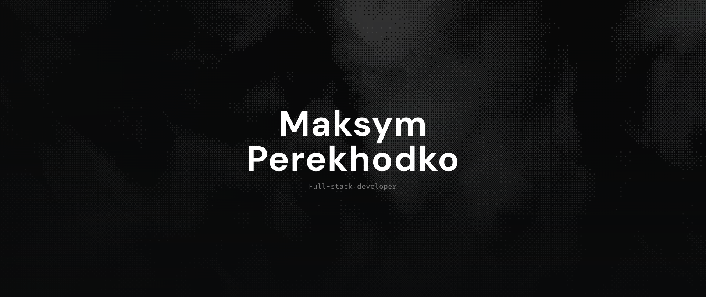

<h1>About me</h1>
<ul>
  <li>Full-stack developer with 1.5 years of professional experience in modern web technologies</li>
  <li>Strong focus on clean architecture, maintainability, and performance optimization</li>
  <li>Advanced English proficiency (C1 level)</li>
  <li>Proven leadership and collaboration skills within development teams</li>
</ul>

<h1>Skills</h1>

<h3>Front-end</h3>

  
  
  
  
  
  
  
  
  
  
  

<h3>Back-end</h3>

  
  
  
  
  
  
  
  
  
  
  
  

<h3>Tools</h3>

  
  
  
  
  
  
  

<h3>Other Skills</h3>

  
  
  
  
  

<h1>Projects</h1>

<!-- <h3>Syncr (Collaboration Platform)</h3>

Full-stack web app that helps teams and companies to integrate with real-time collaborative features and company-based workspace management. Built with NestJS, Drizzle ORM, PostgreSQL, and powered Svelte front-end.

<ul>
  <li>Svelte</li>
  <li>TypeScript</li>
  <li>Vite</li>
  <li>NestJS</li>
  <li>Drizzle ORM</li>
  <li>PostgreSQL</li>
  <li>JWT Authentication</li>
</ul>
<a href="#">Demo (coming soon)</a> | <a href="#">Code</a> -->

<h3>Nice Gadgets Store</h3>

Sleek and user-friendly shop for browsing mobile phones and other devices. It features a clean interface with search, filter, and sorting options, providing detailed phone specifications and images.

<ul>
  <li>React</li>
  <li>Zustand</li>
  <li>Swiper</li>
  <li>Bootstrap</li>
  <li>Sass (SCSS)</li>
  <li>BEM</li>
  <li>Node.js</li>
</ul>
<a href="https://fs-mar24-kyrylos-witnesses.github.io/phone-catalog/">Demo</a> | <a href="https://github.com/fs-mar24-kyrylos-witnesses/phone-catalog">Code</a>

<h3>ToDo App</h3>

Task management tool built with React and TypeScript, using local storage for persistence. It allows adding, deleting, and modifying tasks, with filtering options to view all, active, or completed assignments, and is styled with Bulma and FontAwesome.

<ul>
  <li>React</li>
  <li>TypeScript</li>
  <li>FontAwesome</li>
  <li>Bulma</li>
  <li>Sass (SCSS)</li>
  <li>BEM</li>
</ul>
<a href="https://kinqbert.github.io/react_todo-app/">Demo</a> | <a href="https://github.com/kinqbert/react_todo-app">Code</a>

<h3>MyBike Landing Page</h3>

Responsive static website designed to highlight bicycles and related accessories. It features a modern user interface with smooth animations, built using HTML and SCSS. The site serves as an excellent template for bike-related businesses or product showcases.

<ul>
  <li>HTML</li>
  <li>Sass (SCSS)</li>
  <li>BEM</ul>
<a href="https://kinqbert.github.io/my-bike-landing/">Demo</a> | <a href="https://github.com/kinqbert/my-bike-landing">Code</a>

<h1>My contacts</h1>

  
  
  

